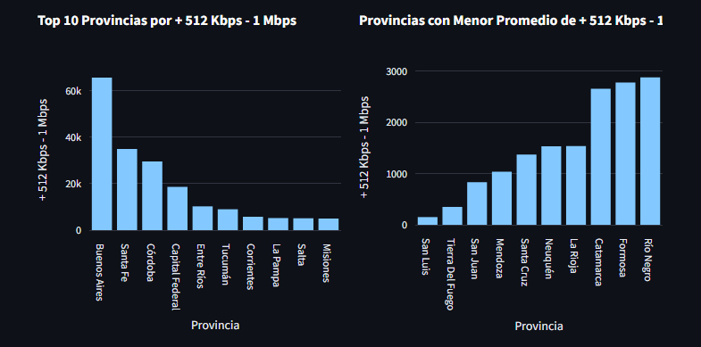
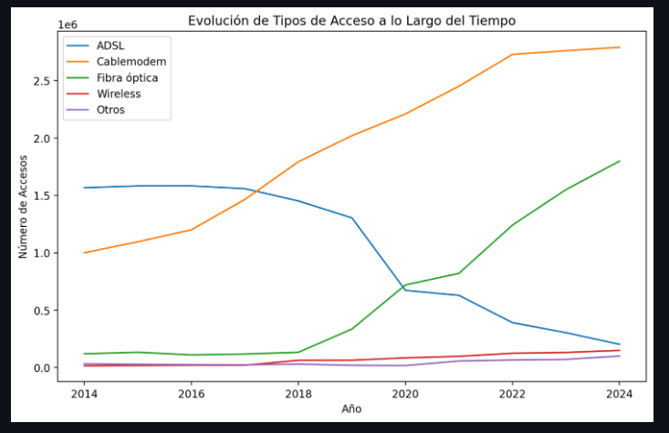

# Análisis Completo del Sector de Telecomunicaciones

## Introducción

Este repositorio contiene un análisis exhaustivo del comportamiento del sector de telecomunicaciones en el ámbito nacional. La empresa prestadora de servicios de telecomunicaciones ha encargado este proyecto para obtener una visión clara sobre el acceso a internet y otros servicios de comunicación. El objetivo es identificar oportunidades de crecimiento, mejorar la calidad de los servicios y ofrecer soluciones personalizadas a los clientes.

## Contenido del Repositorio

El repositorio está organizado de la siguiente manera:

- **`main.py`**: Archivo principal que contiene el código para la aplicación Streamlit. Aquí se definen las secciones del dashboard y los análisis de KPIs.
- **`utils.py`**: Archivo que contiene funciones auxiliares, como `load_data`, que carga los datasets necesarios para el análisis.
- **`kpis.py`**: Contiene las funciones `kpi_1` y `kpi2` que calculan los indicadores clave de rendimiento (KPIs) para la evaluación de los datos.
- **`provincias.py`**: Define la función `provincias_dashboard`, que genera el dashboard para analizar los datos a nivel provincial.
- **`localidades.py`**: Define la función `localidades_dashboard`, que crea el dashboard para el análisis a nivel de localidades.
- **`img/`**: Carpeta que contiene imágenes usadas en el dashboard, como el fondo y el logo.
- **`Dataset_procesados/`**: Carpeta que contiene los datasets procesados utilizados en los análisis.
- **`Notebook/`**: Carpeta que contiene el ETL y Analisis EDA

## Proceso ETL, EDA y Dashboard

### Proceso ETL

1. **Extracción**: Se recopilaron los datos necesarios desde diversas fuentes, como bases de datos, archivos CSV o APIs.
2. **Transformación**: Los datos fueron limpiados y transformados para adecuarse a los requisitos del análisis. Esto incluyó el uso de funciones de limpieza, el manejo de valores nulos, y la modificacion de los tiposd e datos.
3. **Carga**: Los datos transformados se cargaron en un formato adecuado para el análisis, como DataFrames de Pandas.

### Proceso EDA
El Análisis Exploratorio de Datos (EDA) En esta etapa, se generaron diversas gráficas que permiten visualizar la información de acuerdo a los datasets procesados. Además, se identificaron outliers en algunos de estos conjuntos de datos.

## Análisis de Dashboards

### Dashboard Global

El Dashboard Global proporciona una visión integral de los datos de telecomunicaciones a nivel nacional. Incluye los siguientes componentes:

- **Top 10 Provincias por Velocidades**: Gráfico de barras que muestra las diez provincias con el mejor acceso a diferentes tecnologías con Velocidades de internet.
- **Provincias con Menor Promedio de Acceso**: Gráfico de barras que identifica las provincias con el menor acceso promedio a las tecnologías seleccionadas.
- **Ingresos por Año y Trimestre**: Gráfico de líneas que detalla los ingresos generados a lo largo del tiempo.
- **Velocidad Media por Provincia (Top 10)**: Gráfico de barras que muestra la velocidad media de acceso a internet en las diez provincias principales.
- **Distribución de Velocidad Media por Provincia (Top 6)**: Gráfico de torta que representa la distribución de la velocidad media en las seis provincias principales.

**Ejemplos**: 

### Dashboard de Provincias

El Dashboard de Provincias ofrece un análisis detallado de los datos a nivel provincial. Incluye gráficos y KPIs específicos para evaluar el comportamiento en cada provincia.

### Dashboard de Localidades

El Dashboard de Localidades proporciona un análisis a nivel de localidades, permitiendo una evaluación detallada del acceso a internet y otras métricas en áreas más específicas.

## Análisis de KPIs

### KPI 1: Crecimiento de Accesos

**Descripción**: Mide el incremento en el acceso al servicio de internet por provincia. Este KPI es crucial para identificar áreas con mayor potencial de crecimiento.

**Visualización**: La métrica se presenta en el Dashboard Global para proporcionar una visión rápida del crecimiento.

### KPI 2: Crecimiento de Velocidades Promedio

**Descripción**: Representa el aumento promedio en las velocidades de acceso a internet a nivel provincial. Este KPI ayuda a evaluar el rendimiento de las conexiones a internet en diferentes provincias.

**Visualización**: También se presenta en el Dashboard Global, permitiendo una evaluación rápida del crecimiento en velocidades.

## Dashboard en Streamlit

El dashboard fue desarrollado utilizando Streamlit, lo que permite una visualización interactiva de los datos. La aplicación permite a los usuarios explorar diferentes aspectos del análisis a través de filtros y gráficos interactivos. Entre las características destacadas del dashboard se incluyen:

- **Filtros Interactivos**: Los usuarios pueden seleccionar provincias y localidades para personalizar la visualización de datos.
- **Visualizaciones**: Incluye gráficos de barras, gráficos de dispersión y gráficos de torta para mostrar la distribución y comparación de los accesos a diferentes tecnologías.
- **Resumen**: Proporciona un resumen detallado de los insights clave obtenidos a partir del análisis.

Para ver el dashboard en acción, visita el [enlace a la aplicación desplegada](https://proyecto-individual-2-henry-gfargfp6jtyshf9atm5edk.streamlit.app).

## Conclusiones y Recomendaciones

El análisis realizado muestra un panorama claro sobre el acceso a internet y otros servicios de telecomunicaciones en el país. Las visualizaciones destacan áreas clave para la mejora y oportunidades de crecimiento:

- **Áreas de Mejora**: Provincias con menor acceso a tecnologías de internet y velocidades promedio bajas.
- **Oportunidades de Crecimiento**: Provincias con un buen crecimiento en el acceso y velocidades, que podrían ser objetivo de estrategias de expansión.

Se recomienda a la empresa utilizar estos insights para ajustar sus estrategias de servicio y orientación a los clientes.

Realizado por: Evelyn Perez- Analista de Datos 